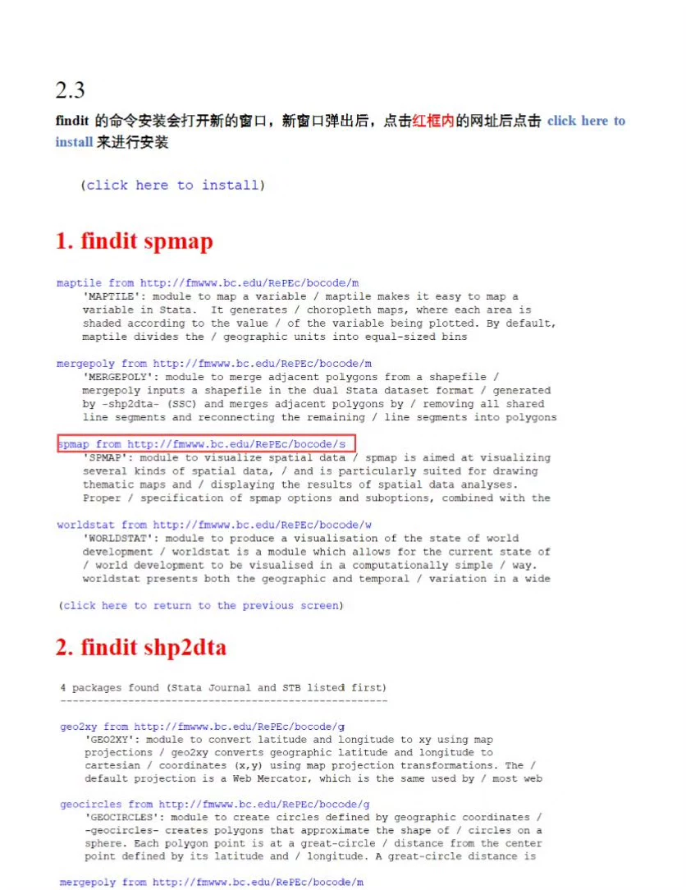
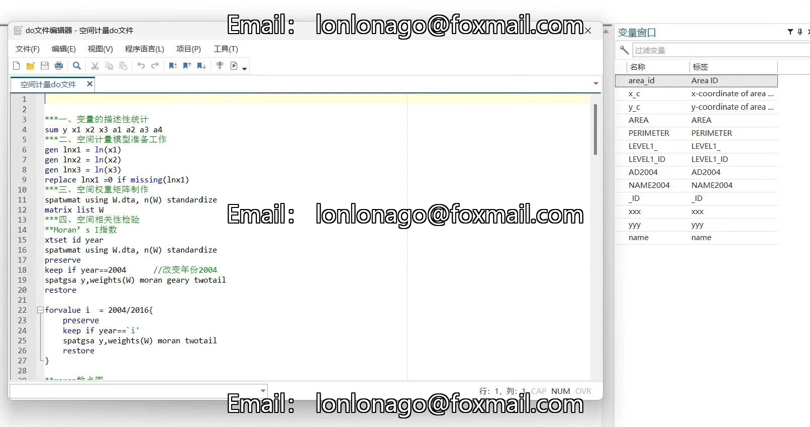

## Body

Spatial Econometric Stata Code and Teaching Materials

I. Product Introduction
Name: Spatial Econometric Stata Code and Teaching Materials
Content:
Teaching Materials: Includes detailed theoretical explanations and practical steps for operation.
Stata Commands and Explanations: Offer all the necessary Stata commands for spatial econometric analysis, along with detailed explanations.
Full Process of Spatial Econometrics: Covers the entire process from data preparation to result interpretation.
Spatial Correlation Tests: Including methods such as Moran's I and Geary's C.
Spatial Models:
Spatial Durbin Model (SDM)
Spatial Lag Model (SLM)
Spatial Error Model (SEM)
LM Test: Used to select the appropriate spatial model.
Fixed Effects and Random Effects Choice: Selected through Hausman Test.
Wald Test and LR Test: Used for model significance test.
Result Interpretation: Providing detailed interpretation of model results.
Map Drawing: Includes methods on how to use Stata to draw maps.
PDF File: A detailed document explaining the entire process.
Stata Do-Document: A direct runnable Stata code file.
Example Data: Provides example data for learning and practice.
Map Data: Map data used for drawing maps.

II. Indicator Description
Including relevant data, variable descriptive statistics and results export, Moran test (spatial autocorrelation test), SDM regression (SDM model), SEM regression (SEM model), SAR model, LM test, LR test, Wald test, Hausman test (fixed effects and random effects selection), testing fixed effects for regions, time fixed effects, and testing for both region and time fixed effects, etc.

This data includes various spatial econometric models, including Moran test, SDM model, SEM model, SAR model, etc. Through the analysis and results export of these models, researchers can have a more accurate understanding of the relationship between different variables and their distribution in space. LM, LR, Wald tests also provide methods for researchers to test the validity of the models. In terms of selecting fixed effects and random effects, the Hausman test provides a powerful tool for researchers to make decisions on choosing appropriate fixed effect or random effect models. Overall, these spatial econometric models provide a spatial econometric analysis framework for economists, helping to deeply understand the essence of economic issues.

## Images

Here is a pay link on Stripe ( https://buy.stripe.com/3cs8yP7sY87d0vu9AB ). Please contact me lonlonago@foxmail.com after funding $89, and I will send you a complete data files , thank you!

